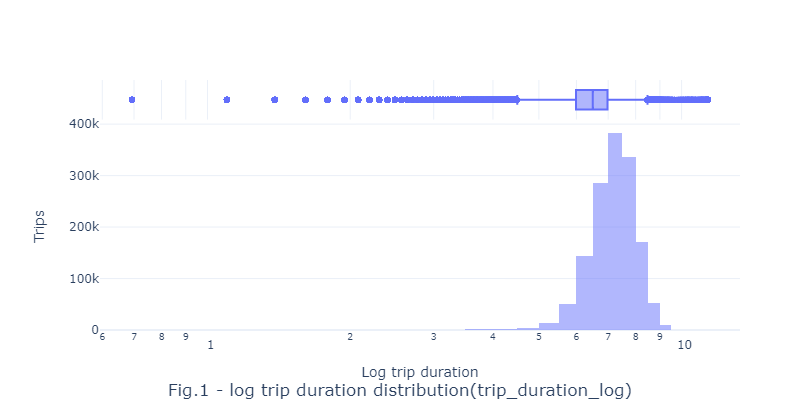
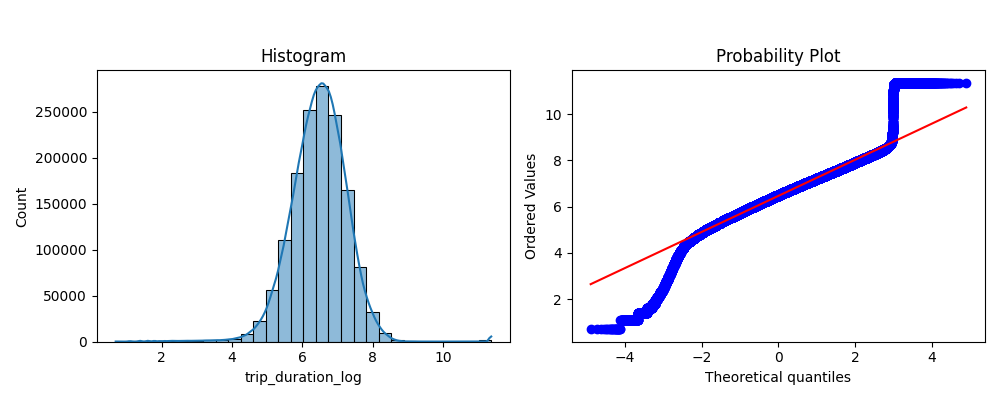

# Trip_optimization

## Content

* [Summary](README.md#Summary)  
* [Project description](README.md#Project-description)  
* [Data and methods](README.md#Data-and-methods)                                
* [Project structure](README.md#Project-structure)                   


---

## Summary
[Competition](https://www.kaggle.com/competitions/nyc-taxi-trip-duration/data)
  

## Project description

High competition in the fintech industry pushes companies to innovate. The *LendingClub* company is the first firm in the US providing peer-to-peer loans between private customers. In addition, the company trades loans on a secondary market. A combination of practical and attractive website, and low interest rates assured fast growth of the client base. This, however, resulted in increase of defaults on the loan repayments rate since current algorythm of the default probability calculation has to be constantly tuned. 

The business objective of the assignment is to identify factors, increasing credit loss of the company such as:
* defaults on the loan repayment
* late installment payments which are subdivided as follows:
    * short overdue (between 16 and 30 days)
    * long overdue (between 31 and 120 days)

An significance estimation of these factors will gradually improves the company profit and provides clients with justified interest rates related to their default risk. 

## Data and methods

The dataset contains information about successful loan applicants that means the loan was approved by the bank. 


<details>
    <summary>Features description</summary>

text
</details>

<div align="center"> 
  </div>

<div align="center">  </div>


## Project structure

<details>
  <summary>display project structure </summary>

```Python
Loan_repayment
├── .gitignore
├── config
│   └── config.json     # configuration settings
├── data                # data archive
│  
├── figures
│   ├── fig_1.png
.....
│   └── fig_xx.png
├── models              # models and weights
│   ├── xxx.pkl
.....
│   └── xxx.pkl
├── notebooks           # notebooks
│   └── Loan_repayment.ipynb

├── README.md
├── requirements.txt    
└── utils               # functions and data loaders
    └── reader_config.py
```
</details>
